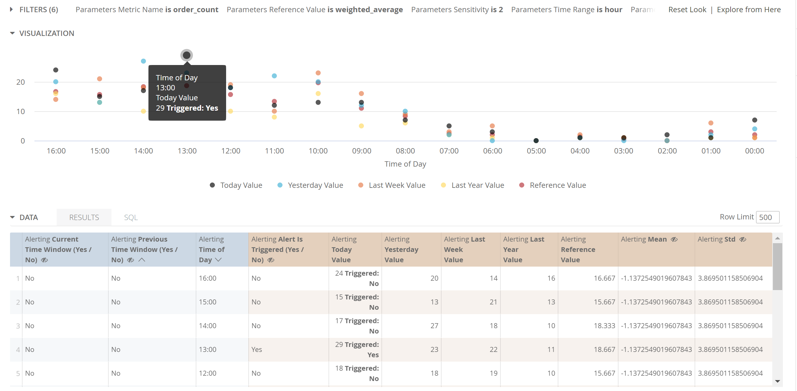

# Alerting Block by [Datatonic](https://datatonic.com/)

Presented in the "Creating a Sophisticated Alerting System with Looker" [JOIN 2020 talk](https://looker.com/events/join-2020/agenda?agendaPath=session/317600). 

**Credits:** 
[David Lequin](https://www.linkedin.com/in/david-lequin/) for pioneering first version. 
[Jamie Fry](https://www.linkedin.com/in/fryjamie/) for version 2. 
[Ben Powis](https://www.linkedin.com/in/benpowis/) for support. 
[Christelle XU](https://www.linkedin.com/in/christellexu/) for BQML wrappers.

Repo upkeep is by Datatonic Looker Team

See the Screenshots section at the bottom of this readme for examples

## What does this block do?

Using stats, LookML and scheduling capabilities,  we are able to track and alert on KPIs in near real time.
Anomalies detected in KPIs will trigger alerts, which will be sent to users using Looker scheduling capabilities.
The thresholds for alerts is dynamic, with different approaches to defining what an "anomaly" is.

This block has weighted averages set up as a default to detect anomalies. But you can also provide a linear regression layer, or more advanced modelling (e.g. using BQML) should you wish. See "how to add more anomaly detection methods"

## Why is this block needed?
Looker has some "alert" functionality built in, but this is built on static hardcoded values, with a dashboard as the entry point for the users to set one up.
Where there is a requirement for an alert trigger to have a dynamically changing value, we need to switch to the Lookml layer of looker to set this up, and utilize lookers scheduling capabilities for the "action".
This allows looker to be used as a sophisticated alerting system, without needing to involve any other middleware. Typical use cases involve alerting on how many orders have been added to basket, which we could check every 5mins compared to same time yesterday, last week and last year.

## How to use this block
-- The files can be dropped into your instance as is. The weighted averages is built out on a demo table called "orders" which is not included in this repo. You will need to replace this table and references to it with your own.

-- If you are not using BigQuery, you may need to change some sql dialect.

-- It is not recommended you use this block without some tweaking to ensure you are taking advantage of the type of data warehouse you have connected to it. E.g. use of indexes, partitions, clustering etc. **This is not a typical "plug and play" block**, you will need to do some testing to determine load on your data warehouse and change the Lookml to account for this. This is essential, otherwise you are running queries across your entire historical data.

-- Use the explore as is to set up some test schedules and check the logic is working as expected, then expose the explore with just the core fields you believe they require.

-- It is recommended you have this block of code in its own project and import files in.

-- There is a BQML templated code dropped in and commented out. If using BigQuery, you can use this template to create your own ML model to create a predicted value to be used as the reference value.

## Setting an alert
It is recommended you watch the "Creating a Sophisticated Alerting System with Looker" JOIN 2020 talk for a show and tell. Note, the "Trigger Flag" filter was missing from this talk.

-- A business user can go to the *alerting* explore to set up an alert.

-- They must select at least one measure or dimension.

-- They can then save as a look and schedule it.

-- In the schedule menu, this is where they should set up their filters. If they did this in the explore when they saved as a look, they should come through to the schedule.

-- All the filters have defaults set, but can be tweaked as required.

-- The filter *Trigger Flag* filter is set to *see only triggered values* as a default. So only rows of data that has been triggered will return in the query

-- The *current Time Window* **or** *previous time window* should be set to YES (not both!). This will ensure only one row of data is returned, rather than all historical alerts.

-- If testing or looking back at historical alerts in the explore set both to NO

-- Optional filters including changing sensitivity or weights for calculating the reference value.

-- Ensure in the schedule under *advanced options* you set *Send this schedule if there are results*

-- Ensure *Deliver this schedule* is set to the same timeframe as the *Parameters Time Frame*

Users will be able to manage all their alerting from this schedule menu.

## How to add more anomaly detection methods
#### Reference values
This will change the "reference value"
Create a new lookml file which holds your method code. For example, a bigquery machine learning model (BQML**) with a looker wrapper. This file should create the reference value.
You will then need to incorporate this into lkml files 4_metrics and 5_alerting.
You will find in this repo a number of commented out lines in those two files. These lines show you where in the codebase you need to add in lookml to bring in another reference value.
For this repo, some demo code has been provided for a linear regression method in BQML as a alternative method to weighted averages.

**see these blogs for how to wrap BQML in looker:
[implementing your first bqml algorithm in looker](https://datatonic.com/insights/implementing-your-first-bqml-algorithm-in-looker/)
[BQML Linear Model Demo in Looker](https://datatonic.com/insights/bqml-linear-model-looker/)

# Screenshots
### Example of the email alert:

___

### Example of setting up the alert schedule:

___

### Example of the alert metrics:

___

### Example of the alert toggles:

___

## Contribute / Bugs

This has been open sourced for the community. If you wish to Contribute please do so via a PR in the GitHub repo.

**Fixing bugs will only be actioned with a an issue raised via the GitHub repo**
